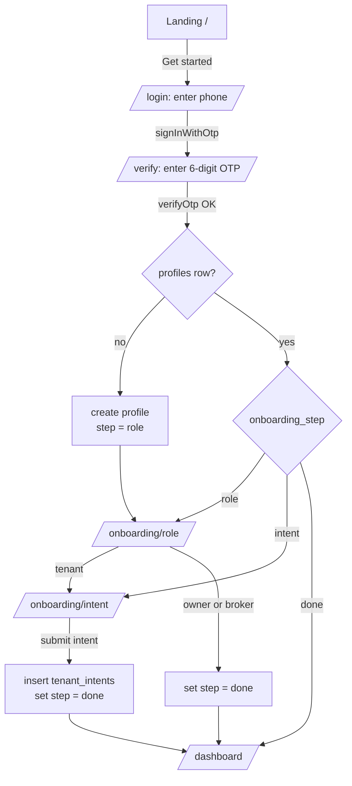
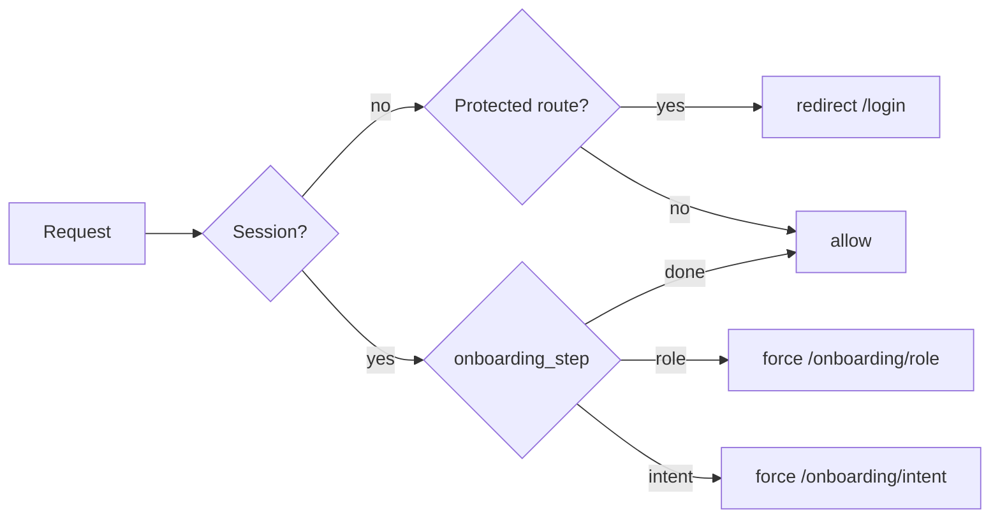
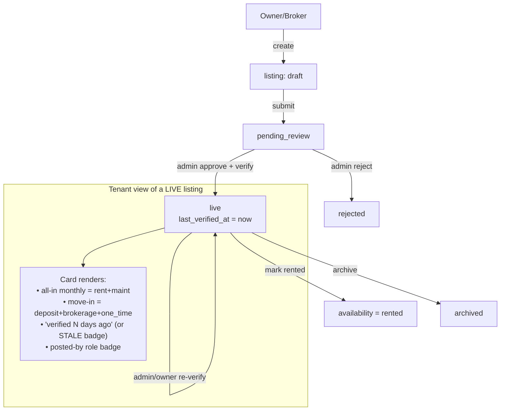
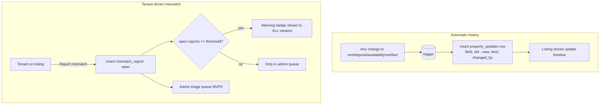
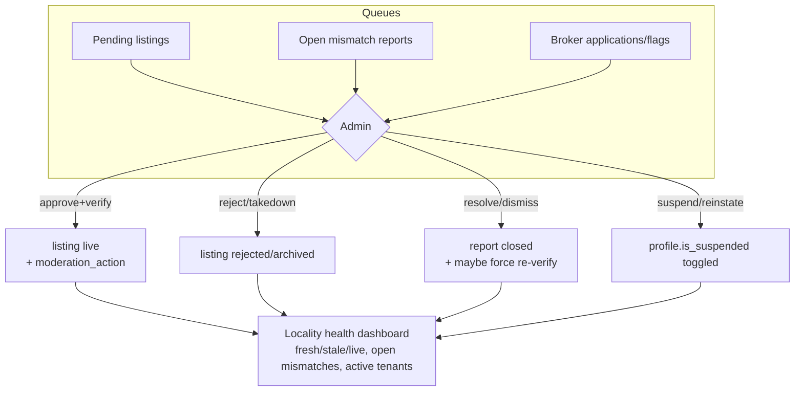

# Kiraya — User & System Flows

## 1. MVP1 — Auth + onboarding state machine

The onboarding step is stored on `profiles.onboarding_step` and enforced by middleware, so any
refresh/deep-link resumes at the correct screen.



**Middleware guard (every request):**



## 2. MVP2 — Listing lifecycle & the "truth" render



## 3. MVP3 — Update history + mismatch warning



## 4. MVP4 — Broker suggestion (replacing WhatsApp)

```mermaid
sequenceDiagram
    participant B as Broker
    participant S as Kiraya
    participant T as Tenant
    B->>S: Browse verified tenant intents (no PII)
    B->>S: Suggest property X → intent Y (+message)
    S->>S: insert broker_suggestion (status=sent)\nmust reference a LIVE listing
    S-->>T: In-app card: full verified listing + note
    T->>S: Open card (status=viewed)
    alt Interested
      T->>S: Accept (status=accepted)
      S-->>B: Notified; contact exchange unlocked
    else Not interested
      T->>S: Decline / Not relevant
    end
    Note over B,T: Every step logged. No WhatsApp, no off-platform "DM me".
```

## 5. MVP5 — Admin moderation loop



## Route map

| Route | MVP | Access |
|---|---|---|
| `/` | 1 | public |
| `/login`, `/verify` | 1 | public (redirects out if authed) |
| `/onboarding/role`, `/onboarding/intent` | 1 | authed, gated by step |
| `/dashboard` | 1 | authed, onboarding done |
| `/listings`, `/listings/[id]` | 2 | public read (live only) |
| `/listings/new` | 2 | owner/broker/admin |
| update timeline + report action on `/listings/[id]` | 3 | public read / authed report |
| `/suggestions` | 4 | anyone holding an intent (`0024`) |
| `/broker/intents` | 4 | broker only |
| `/admin` (health), `/admin/listings`, `/admin/reports`, `/admin/people` | 5 | admin only |
| `/admin/duplicates` (`0021`), `/admin/history` (`0017`) | — | admin only |
| `/listings/[id]/edit`, `/listings/[id]/photos` | — | the poster, or admin |
| `/shortlist` (`0011`), `/notifications` (`0012`) | — | any signed-in user |
| `/intent` | 1 | any signed-in user since `0024` — not tenants only |
| `/api/notifications/deliver` (`0026`) | — | bearer token, not a session |


---

## 6. The loop after MVP5

What the five MVPs left out was everything between "a tenant found a listing" and "somebody moved
in". These flows fill it, and each one is written by the database rather than the app.

**Enquiry → visit → verdict.** A tenant asks for contact (`0010`); both numbers appear at once,
capped per day, recorded on both sides. That exchange is the standing to propose a visit (`0020`) —
propose, confirm or decline, and neither side can confirm their own proposal. A confirmed visit
whose time has passed asks one question three days later: did you go, was it as described (`0015`).
Answers land in `v_listing_accuracy`, which nothing yet reads.

**Freshness has a clock (`0025`).** Every other trigger in this system fires because somebody wrote
a row; these fire because a date arrived. A daily sweep nudges posters whose listings are about to
go stale — once per verification cycle, never daily, and confirming re-arms it. A second job
reminds both sides of tomorrow's viewing.

**Notices leave the building (`0026`).** Everything above writes a `notification`, which was in-app
only until a delivery run at `/api/notifications/deliver` began sending a digest per person per
run. It fails closed: no shared secret means the route is off, not open.

**Truth in the listing itself.** A broker must state their fee before a listing goes live and an
owner cannot charge one (`0023`); the pin says exactly which building it is (`0027`); the area,
the median comparison and the matcher all agree about geography (`0019`, `0028`, `0029`); and
`v_possible_duplicates` (`0021`) shows an admin when the same flat has been posted three times by
three brokers at three prices.
