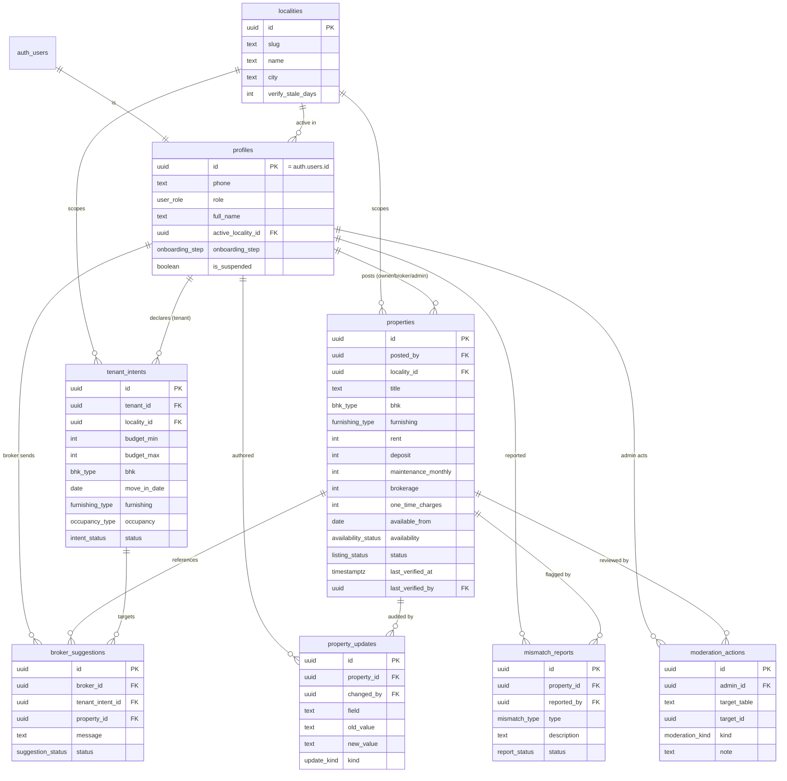

# Kiraya — Data Model

Postgres on Supabase. Auth is Supabase `auth.users`; every app user has a 1:1 `profiles`
row keyed by `auth.uid()`. All tenant-facing tables are protected by **Row Level Security**.

The schema is designed **holistically up front** but shipped **migration-by-migration** so each
MVP adds only its tables. Files: `supabase/migrations/0001…0005`.

## Entity-relationship overview

## Enums

| Enum | Values | Introduced |
|---|---|---|
| `user_role` | `tenant`, `owner`, `broker`, `admin` | MVP1 |
| `onboarding_step` | `role`, `intent`, `done` | MVP1 |
| `bhk_type` | `1rk`, `1bhk`, `2bhk`, `3bhk`, `4plus` | MVP1 |
| `furnishing_type` | `unfurnished`, `semi`, `full` | MVP1 |
| `occupancy_type` | `family`, `bachelors_male`, `bachelors_female`, `any` | MVP1 |
| `intent_status` | `active`, `paused`, `fulfilled` | MVP1 |
| `availability_status` | `available`, `on_hold`, `rented` | MVP2 |
| `listing_status` | `draft`, `pending_review`, `live`, `rejected`, `archived` | MVP2 |
| `update_kind` | `price`, `availability`, `terms`, `verification`, `other` | MVP3 |
| `mismatch_type` | `price_higher`, `already_rented`, `wrong_furnishing`, `wrong_details`, `unreachable`, `other` | MVP3 |
| `report_status` | `open`, `resolved`, `dismissed` | MVP3 |
| `suggestion_status` | `sent`, `viewed`, `accepted`, `declined`, `not_relevant`, `withdrawn` | MVP4 |
| `moderation_kind` | `approve`, `reject`, `verify`, `takedown`, `suspend_user`, `reinstate_user`, `resolve_report`, `dismiss_report` | MVP5 |

## Table notes

### `profiles` (MVP1)
1:1 with `auth.users`. `onboarding_step` is the state machine that drives routing:
`role` → `intent` (tenants only; owner/broker skip to `done`) → `done`. `active_locality_id`
pins the user to the single launch locality. `is_suspended` gates access (MVP5 broker moderation).

### `tenant_intents` (MVP1)
One active row per tenant per locality is the norm (not hard-enforced — a tenant may keep a
paused history). Budget is stored as integer rupees (`budget_min`/`budget_max`). This is the
demand signal brokers act on in MVP4 — **contact details are never exposed**, only structured intent.

### `properties` (MVP2)
The heart of the "truth layer". Cost is stored as **separate integer components** so the UI can
render an honest, itemised breakdown and a computed all-in number — never a single fuzzy "price".
- **Freshness** = `last_verified_at`; a listing is *stale* when
  `now() - last_verified_at > locality.verify_stale_days`. Computed in a view, not stored, so it's
  always current.
- **Authorship** = `posted_by` (+ their `role` gives the "posted by owner/broker/admin" badge).
- `status` is the moderation lifecycle; only `live` listings are tenant-visible.

### `property_updates` (MVP3)
Append-only audit log. A trigger on `properties` writes a row on every change to a watched column
(rent, deposit, availability, `last_verified_at`, …). This *is* the "update history" feature and the
source of "rent changed ₹18k → ₹20k" lines. Never updated or deleted.

### `mismatch_reports` (MVP3)
Tenant-submitted discrepancies. A listing with ≥ N open reports gets a warning badge (surfaced via a
view). Feeds the admin triage queue (MVP5).

### `broker_suggestions` (MVP4)
A broker links a real `property` to a real `tenant_intent` with a short message. The tenant sees a
card and transitions the `status`. Enforces **on-platform, referenced, logged** — the anti-WhatsApp
mechanism. Contact is only exchanged after `accepted` (out of MVP scope how; the log exists).

### `moderation_actions` (MVP5)
Generic admin audit trail (`target_table` + `target_id`) so every admin action — approve, verify,
takedown, suspend — is attributable and reviewable.

## RLS policy summary

| Table | Read | Write |
|---|---|---|
| `profiles` | own row; admin all | own row (insert/update self); admin all |
| `localities` | everyone (public reference) | admin only |
| `tenant_intents` | own; **broker** sees `active` intents in-locality (no PII); admin all | tenant owns theirs; admin all |
| `properties` | everyone sees `live`; poster sees own; admin all | poster creates/edits own (non-`live` fields); **verify/approve = admin** (MVP5) |
| `property_updates` | anyone who can read the property | insert via trigger / poster+admin; **no update/delete** |
| `mismatch_reports` | reporter own; poster of the property; admin | tenant inserts; admin updates status |
| `broker_suggestions` | the broker who sent; the tenant who owns the intent; admin | broker inserts; tenant updates status on own; admin all |
| `moderation_actions` | admin only | admin only |

> **Helper:** a `SECURITY DEFINER` function `public.is_admin()` (reads the caller's `profiles.role`)
> keeps admin checks out of every policy body and avoids RLS recursion on `profiles`.

## Derived views

- `v_listings_public` — `live` properties joined to poster role + computed `all_in_monthly`,
  `move_in_cost`, `is_stale`, `days_since_verified`, and `open_mismatch_count`. This is what the
  tenant feed and cards read from.
- `v_locality_health` (MVP5) — per-locality fresh/stale/live counts, open mismatches, active
  verified tenants for the admin dashboard.
